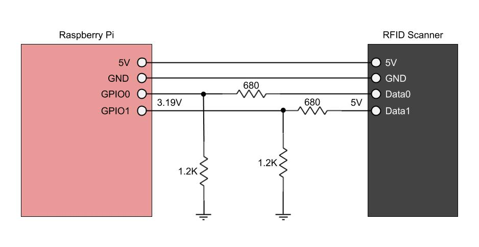

# rfid-scanner
A KISS Python program to interface Raspberry Pi + RFID reader and send data to a library app server. To use, pass the web app server URL as an argument when running the script on a Raspberry Pi.

RFID Scanner model: LNL-MT11

Comms: Wiegand Protocol

Circuit Diagram:

Command format:

http://\<IP\>:\<PORT\>\<API CALL\>

- Made with :heart:
